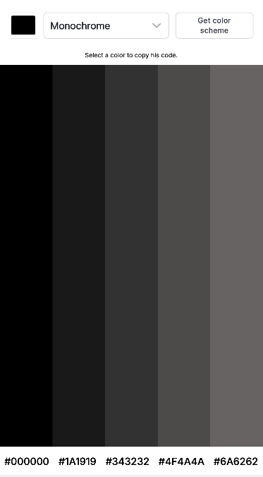

# 🎨 Color Scheme Generator

A clean and interactive web application that generates color palettes based on a seed color and a specific harmonic mode. It fetches data dynamically from **TheColorAPI** and allows users to copy hex codes instantly.

<p align="center">
  
</p>

## ✨ Features

* **Color Selection:** Choose any base color using the native color picker.
* **Harmony Modes:** Support for various color schemes including:
    * Monochrome (Dark/Light)
    * Analogic
    * Complement
    * Triad
    * Quad
* **Live Preview:** Visual representation of the generated palette.
* **Click-to-Copy:** Click on any color bar or hex code to copy the value to your clipboard.
* **User Feedback:** A popup modal confirms when a color has been successfully copied.
* **Responsive Design:** Adapts to different screen sizes using Flexbox.

## 🛠️ Technologies Used

* **HTML5**: Semantic markup.
* **CSS3**: Flexbox layout, custom styling, and CSS transitions.
* **JavaScript (ES6)**: DOM manipulation, Event Listeners, and Fetch API.
* **API**: [TheColorAPI](https://www.thecolorapi.com/) for generating color schemes.
* **Fonts**: Inter (via Google Fonts).

## 🚀 How to Use

1. **Clone the repository** to your local machine:
   ```bash
   git clone https://github.com/Michele20488/color-scheme-generator.git

2. **Online without setups** from this website:
    ```bash
    https://colorscheme-gen.netlify.app
